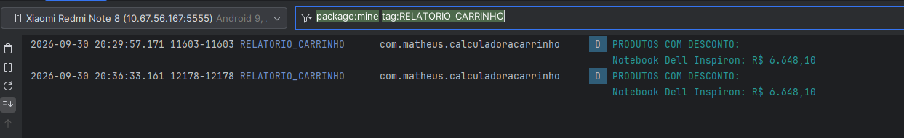

# Calculadora de Carrinho de Compras

**Aluno:** Matheus Ferrari Abrahão  
**Disciplina:** Programação de Dispositivos Móveis

## Sobre o projeto

Aplicativo Android desenvolvido com Kotlin e
Jetpack Compose para simular um carrinho de compras,
aplicar descontos e calcular o valor final do pedido.

## Tecnologias utilizadas

- Kotlin
- Jetpack Compose
- Material Design 3
- Android Studio

## Funcionalidades

- Catálogo fixo com seis produtos.
- Cálculo de subtotal, descontos e valor final.
- Interface com componentes reutilizáveis.
- Tratamento de descrições nulas.
- Truncamento de nomes e descrições.
- Relatório de produtos com desconto no Logcat.

## Arquitetura

O projeto está organizado em três camadas:

- data: catálogo fixo de produtos.
- domain: modelos, interface Pagavel e cálculos.
- ui: componentes e interface com Jetpack Compose.

## Resultados

| Descrição | Valor |
|---|---:|
| Subtotal | R$ 7.437,80 |
| Descontos | R$ 349,90 |
| Total final | R$ 7.087,90 |

## Capturas de tela

### Aplicativo no emulador

### Relatório no Logcat

## Vídeo de apresentação

Link do YouTube: em breve.
